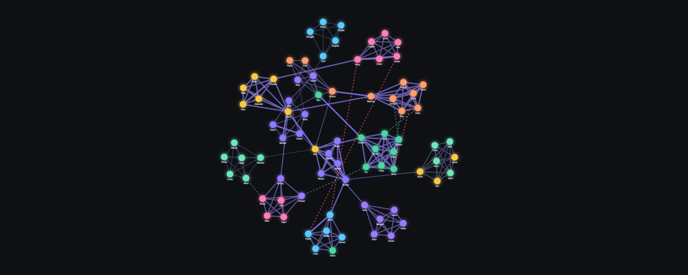

<p align="center">
<h2>Wedding Seating Chart</h2>
</p>

A vibe-coded web app for planning wedding (or any event) seating. Map out who knows whom on a relationship graph, then let a happiness-aware solver lay out the tables — keeping couples together, splitting people who shouldn't share a table, and doing its best so nobody feels left out.

No backend, no database. Everything runs in your browser; optionally sync the whole plan live to a Google Sheet.

```
Guests ──▶ Connections ──▶ Force graph ──▶ Generate ──▶ Round-table chart
                                                     └──▶ Google Sheets (optional)
```

## Features

- **Relationship graph** — an Obsidian-like force-directed view of your guests. Closer ties are thicker/brighter; "must not sit together" pairs visibly repel.
- **Named closeness tiers** — pick human labels (Best friend, Sibling, Close friend, … Acquaintance) that map to numeric weights. Includes a **🚫 Must not sit together** hard constraint and a soft **Might get along** hint.
- **Couples stay together** — anyone marked *Partner / Spouse* is treated as an inseparable unit and never split across tables.
- **Best-effort seating solver** that optimises a **felt-happiness** model: each guest cares about *who's at their table* and *how left out they feel* from the biggest gathering of their friends happening elsewhere.
- **Tunable to taste** with live sliders & toggles — see [Tuning](#-tuning-the-solver).
- **Round-table view** — each table drawn as a circle with guests seated around it, relationship "chords" across the table, and **every guest tinted by their personal happiness** (green → red).
- **Bulk group connect** — select a group of people and link them all at once.
- **Friends-of-friends suggestions** when adding connections.
- **CSV / JSON import & export**, plus **live two-way Google Sheets sync**.
- **Dark, polished UI** — keyboard-friendly, responsive panels.

## Quick start

```bash
npm install
npm run dev        # http://localhost:5173
```

```bash
npm run build      # type-check + production build to dist/
npm run preview    # serve the production build locally
```

Requires Node 18+.

## How the seating solver works

Most seating tools grade a table by *what could be* (an idealised best case). This one grades by **what is**, from each guest's point of view:

- **Who's with me** — the weight of my friends seated at my own table.
- **How left out I feel** — the single biggest cluster of my friends gathered together at *another* table (the party I'm missing). Using the *biggest* cluster means "everyone-but-me together" hurts most, while a group merely *split in two* hurts far less.

Those combine into a per-guest happiness score. The optimiser then **minimises everyone's shortfall convexly**, so a few badly-left-out guests cost more than many slightly-imperfect ones — it won't sacrifice one person to mildly please several. Hard "must not sit together" pairs are a heavy penalty; couples move as a unit. It runs an affinity-greedy seed followed by hill-climbing relocations and swaps, all deterministic from a seed so **Regenerate** explores fresh layouts.

### Tuning the solver

| Control | What it does |
|---|---|
| **Seats per table / Number of tables** | Table capacity. Toggle **Auto-fit tables** to size the count to your guests. |
| **Allow empty seats** | Fill tables to capacity (partial last table) vs. spread guests evenly. |
| **Closeness weighting** | How sharply closer ties out-weigh weaker ones (geometric taper). |
| **FOMO (left-out aversion)** | How hard the solver fights to keep nobody left out. |
| **Group cohesion** | How strongly friend-groups are kept intact at one table. |
| **Per-guest FOMO** (😎 / 🙂 / 🥺) | Mark individuals chill or clingy — clingy guests are protected first, chill guests yield. |
| **Optimization effort** | Quick / Balanced / Thorough (more search = better layout). |
| **Score by least-happy guest** | Show each table's score as its unhappiest member instead of the average. |

## Relationship tiers

Tiers live in one place — `src/components/form/config/relationship-tiers.ts`. Everything else (dropdowns, graph styling, solver weights) derives from that list, so you can rename, re-weight, or add tiers by editing that file. Lower weight = closer. Several labels may share a weight (e.g. *Sibling* and *Close friend* are both 2); the exact label you pick is preserved through export.

## Import / Export

- **JSON** — a complete project snapshot (guests + connections), round-trips perfectly including per-guest FOMO.
- **CSV** — an edge list `Source,Target,Relationship` using guest names and tier labels; importing auto-creates guests, and a name with blank Target/Relationship is a guest with no connections yet.
- You can also import **just a list of names** (one per line) to bootstrap quickly.

## 🔗 Live Google Sheets sync (optional)

The right-hand panel can mirror your plan to a Google Sheet and keep it in sync **both directions** — push your edits up, and pull edits made in the sheet back into the app (polled). It's a no-backend, in-browser OAuth flow: data goes straight from your browser to your own Google account.

1. Create a Google OAuth **Client ID** — step-by-step is in [`.env.example`](.env.example).
2. Copy `.env.example` to `.env.local`, paste your `VITE_GOOGLE_CLIENT_ID`, and restart the dev server.
3. In the app: **Connect Google → Create new spreadsheet** (or paste an existing Sheet URL to attach it — existing seating data is imported, not overwritten).

It writes three tabs — **Seating**, **Guests**, **Connections**. Without a Client ID the panel simply shows setup instructions and everything else works unchanged.
